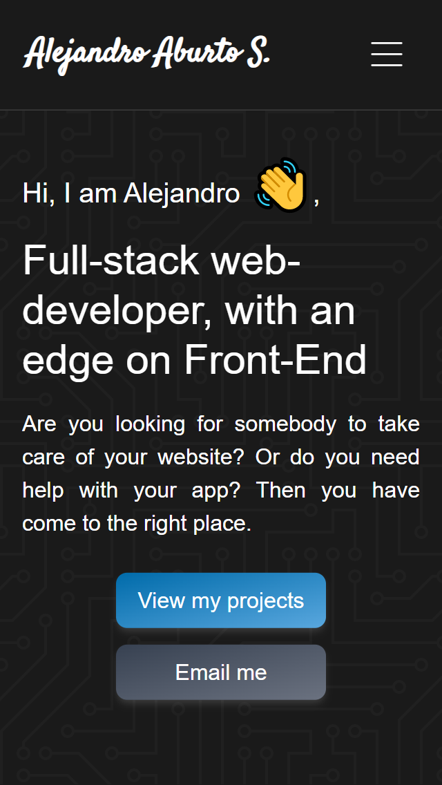
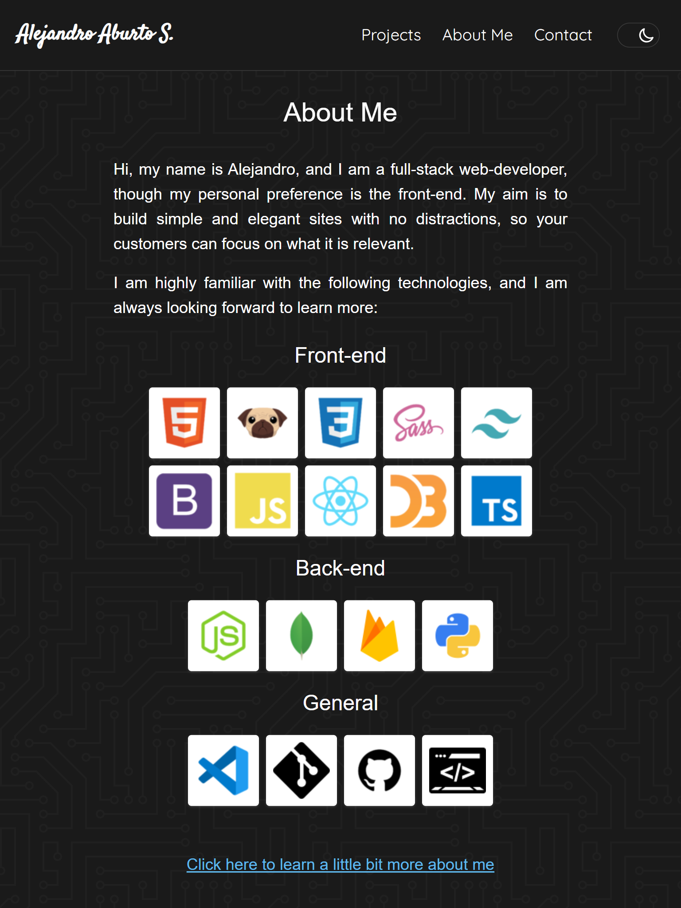
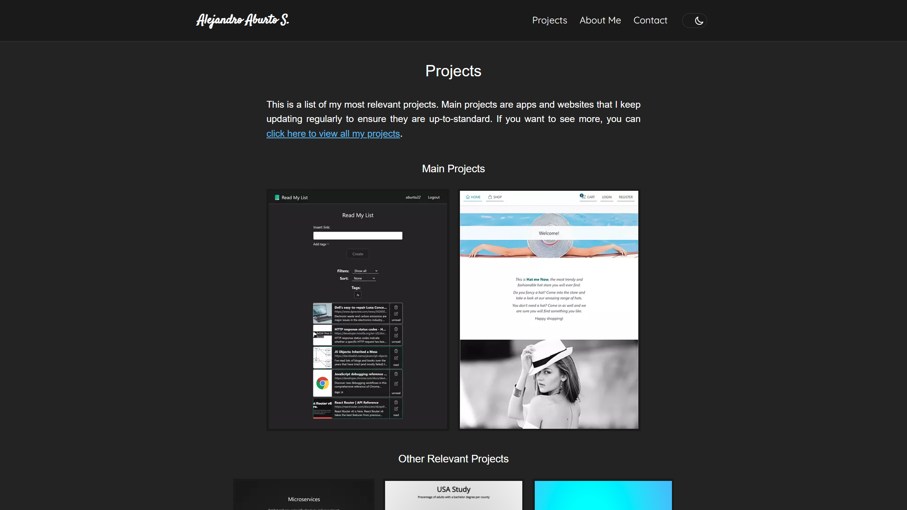

# Portfolio
> A place where I can show you what I am up to, and tell you a bit about myself. I use contenful as a CMS to manage project info, so I can quickly update my portfolio.
>
> This website is hosted in vercel: [_Click here to take a look._](https://portfolio-aburto22.vercel.app/)

## Table of Contents
* [General Info](#general-information)
* [Technologies Used](#technologies-used)
* [Features](#features)
* [Screenshots](#screenshots)
* [Setup](#setup)
* [Project Status](#project-status)
* [New features](#new-features)
* [Authors](#authors)

## General Information
### Context
Indispensable for every developer, I created this portfolio early and keep updating it to make it better and adding more and more projects.

### Idea
Goes without saying. A place where I can showcase my work, give contact details, and tell a little bit about myself.

## Technologies Used
### Front-end
- TypeScript
- Next.js
- SWR
- CSS Modules
- EmailJS (to implement contact form)
- Contentful

### Deployment and hosting
- Vercel hosting

## Features
My portfolio consists of a main page showing my main projects, technologies I work with and contact details. There are also more detailed pages:
- About me page with the story about how I became a Full-Stack JavaScript developer.
- Projects page showing all projects and apps I created.
- Email sending to personal account when users use contact form.

## Screenshots
  

## Setup
Classic create-react-app project. Go into client folder and install dependencies using `npm install`, and then run the development server using `npm start`.

In order to run a local copy, users need to include an .env file in the server folder with the following information:
- REACT_APP_EMAILJS_SERVICE_ID - Service ID for EmailJS
- REACT_APP_EMAILJS_TEMPLATE_ID - Template ID for email for EmailJS 
- REACT_APP_EMAILJS_USER_ID - User ID form EmailJS

## Project Status
A portfolio is always ongoing. There are always things to improve and new projects to add.

## New features and bugs
Known bugs:
- In very rare cases, a project tile won't return to its normal status (showing project screenshot) after stop hovering.

## Authors

|  |
| ---------------------------------------------------------------------------------------------------------------------- |
| [Alejandro Aburto Salazar](https://github.com/aburto22)                                                                |